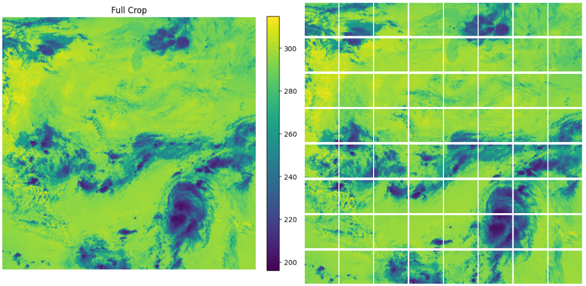
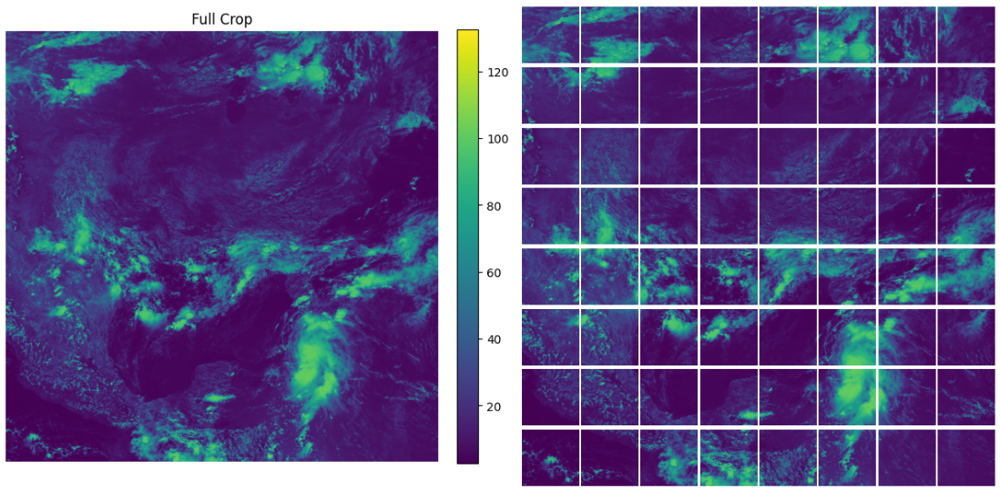

# GRIDRAD

## Data Preprocessing

### VENV

```bash
python3 -m venv venv
source venv/bin/activate
pip install -r requirements.txt
```

Where `requirements.txt` is:

```txt
anyio==4.8.0
argon2-cffi==23.1.0
argon2-cffi-bindings==21.2.0
arrow==1.3.0
asttokens==3.0.0
async-lru==2.0.4
attrs==25.1.0
babel==2.17.0
beautifulsoup4==4.13.3
bleach==6.2.0
braceexpand==0.1.7
certifi==2025.1.31
cffi==1.17.1
cftime==1.6.4.post1
charset-normalizer==3.4.1
comm==0.2.2
contourpy==1.3.1
cycler==0.12.1
debugpy==1.8.12
decorator==5.1.1
defusedxml==0.7.1
einops==0.8.1
executing==2.2.0
fastjsonschema==2.21.1
filelock==3.13.1
fonttools==4.56.0
fqdn==1.5.1
fsspec==2024.6.1
h11==0.14.0
h5py==3.13.0
httpcore==1.0.7
httpx==0.28.1
idna==3.10
imageio==2.37.0
ipykernel==6.29.5
ipython==8.32.0
ipywidgets==8.1.5
isoduration==20.11.0
jedi==0.19.2
Jinja2==3.1.5
joblib==1.4.2
json5==0.10.0
jsonpointer==3.0.0
jsonschema==4.23.0
jsonschema-specifications==2024.10.1
jupyter==1.1.1
jupyter_client==8.6.3
jupyter-console==6.6.3
jupyter_core==5.7.2
jupyter-events==0.12.0
jupyter-lsp==2.2.5
jupyter_server==2.15.0
jupyter_server_terminals==0.5.3
jupyterlab==4.3.5
jupyterlab_pygments==0.3.0
jupyterlab_server==2.27.3
jupyterlab_widgets==3.0.13
kiwisolver==1.4.8
lazy_loader==0.4
MarkupSafe==3.0.2
matplotlib==3.10.1
matplotlib-inline==0.1.7
mistune==3.1.2
mpmath==1.3.0
nbclient==0.10.2
nbconvert==7.16.6
nbformat==5.10.4
nest-asyncio==1.6.0
netCDF4==1.7.2
networkx==3.3
notebook==7.3.2
notebook_shim==0.2.4
numpy==2.2.3
nvidia-cublas-cu12==12.6.4.1
nvidia-cuda-cupti-cu12==12.6.80
nvidia-cuda-nvrtc-cu12==12.6.77
nvidia-cuda-runtime-cu12==12.6.77
nvidia-cudnn-cu12==9.5.1.17
nvidia-cufft-cu12==11.3.0.4
nvidia-curand-cu12==10.3.7.77
nvidia-cusolver-cu12==11.7.1.2
nvidia-cusparse-cu12==12.5.4.2
nvidia-cusparselt-cu12==0.6.3
nvidia-nccl-cu12==2.21.5
nvidia-nvjitlink-cu12==12.6.85
nvidia-nvtx-cu12==12.6.77
opencv-python==4.11.0.86
overrides==7.7.0
packaging==24.2
pandas==2.2.3
pandocfilters==1.5.1
parso==0.8.4
pexpect==4.9.0
pillow==11.1.0
pip==25.0.1
platformdirs==4.3.6
prometheus_client==0.21.1
prompt_toolkit==3.0.50
psutil==7.0.0
ptyprocess==0.7.0
pure_eval==0.2.3
pycparser==2.22
Pygments==2.19.1
pyparsing==3.2.1
python-dateutil==2.9.0.post0
python-json-logger==3.2.1
pytz==2025.1
PyYAML==6.0.2
pyzmq==26.2.1
referencing==0.36.2
requests==2.32.3
rfc3339-validator==0.1.4
rfc3986-validator==0.1.1
rpds-py==0.23.0
scikit-image==0.25.2
scikit-learn==1.6.1
scipy==1.15.2
Send2Trash==1.8.3
setuptools==75.8.0
six==1.17.0
sniffio==1.3.1
soupsieve==2.6
stack-data==0.6.3
sympy==1.13.1
terminado==0.18.1
threadpoolctl==3.5.0
tifffile==2025.2.18
tinycss2==1.4.0
torch==2.6.0+cu126
torchaudio==2.6.0+cu126
torchvision==0.21.0+cu126
tornado==6.4.2
tqdm==4.67.1
traitlets==5.14.3
triton==3.2.0
types-python-dateutil==2.9.0.20241206
typing_extensions==4.12.2
tzdata==2025.1
uri-template==1.3.0
urllib3==2.3.0
wcwidth==0.2.13
webcolors==24.11.1
webdataset==0.2.111
webencodings==0.5.1
websocket-client==1.8.0
widgetsnbextension==4.0.13
```

### DOCKER

#### Build

```bash
docker buildx build --platform linux/amd64,linux/arm64 -t yourusername/pytorch-env:latest --push .
```

```bash
docker pull yourusername/pytorch-env:latest
```


#### Run

```bash
docker run -it --gpus all -v /path/to/local/repo:/workspace/repo -v /path/to/local/data:/data yourusername/pytorch-env:latest
```

Then from the container go to the dataset directory, in which you will find the scripts for preprocessing the data.

```bash
cd /workspace/repo/dataset
```

Then from there run `python` and follow the steps in the script.

```python
from utils import process_directory_tree
input_dir = '/data/GridRad/'
output_dir = '/data/Output/'
process_directory_tree(input_dir=input_dir, output_dir=output_dir, checkpoint_file='checkpoint_file', n_workers=10)
```

Now you have already abunch of `.npz` files in the `/data/Output/` directory.
In order to conduct the preprocessing, you need to have such data in the `/data/Ouput/` directory.

The preprocessing script is simply taking the `.npz` files and converting them into `.pt` files, ready to be used in the training process.
For instance, in each `.npz` file, you have the following
a crop of shape `(C, 2048, 2048)` and patches of shape `(8, 8, C, 256, 256)`, where `C` is the number of channels (e.g. 1 or 2).

The following script will read the `.npz` files one by one, and then compose two tensors, one for the crop and one for the patches.
The crops tensor will have a shape of `(M, 2048, 2048)`, where `M` is the total number of channels collected though the iteration.
The patches tensor will have a shape of `(N, 256, 256)`, where `N` is the total number of patches collected through the iteration (somehting about `8 x 8 x C x` the number of `.npz` files.


```python
from utils import process_npz_files_progressive
directory_path = '/data/Output/'
process_npz_files_progressive(directory_path)
```

This script will run in parallel and will save the `.pt` files in the same directory as the `.npz` files.

If you want to form a proper dataset you have to locate each pytorch tensor in a file.
You can do it with the following script:

This is for locating mono-channel crops tensors in individual files.

```python
from utils import process_all_chunks_to_individual_files
folder_path = '/path/to/data/' # inside data there should be a folder called Crops
# You can adjust the thresholds as needed.
process_all_chunks_to_individual_files(folder_path,
                                       crops=True,
                                       max_deviation_factor=10,
                                       global_mean_deviation_factor=10)
```

This is for locating mono-channel patches tensors in individual files.

```python
from utils import process_all_chunks_to_individual_files
folder_path = '/path/to/data/' # inside data there should be a folder called Patches
# You can adjust the thresholds as needed.
process_all_chunks_to_individual_files(folder_path,
                                       patches=True,
                                       max_deviation_factor=10,
                                       global_mean_deviation_factor=10)
```

The `max_deviation_factor` is the maximum deviation factor in the tensor values to be considered as a valid tensor.
The `global_mean_deviation_factor` is the maximum deviation factor in the tensor values to be considered as a valid tensor, considering the global mean of several tensors.

Some of those tensors break the training process, so it is important to filter them out.
They basically have a very high or very low value, which produces a NaN in the loss function.


### APPTAINER

#### Build

To run the code on [ALCF Polaris](https://www.alcf.anl.gov/polaris) supercomputer, we will use the Apptainer containerization tool.

For more information on how to run jobs on Polaris, please refer to the following link:
[Polaris](https://docs.alcf.anl.gov/polaris/running-jobs/)

For more information on how to manage containers on Polaris, please refer to the following link:
[Apptainer](https://docs.alcf.anl.gov/polaris/containers/containers/)


Once you have access to polaris, you can use the following commands to run the code on the supercomputer.

First, you need to login to the compute node.
Use the following command  to login interactively to the compute node:

```bash
qsub -I -l select=1 -l filesystems=home:eagle:grand -l walltime=1:00:00 -q debug -A <Projectname>
```

Then, you need to load the required modules:

```bash
export HTTP_PROXY=http://proxy.alcf.anl.gov:3128
export HTTPS_PROXY=http://proxy.alcf.anl.gov:3128
export http_proxy=http://proxy.alcf.anl.gov:3128
export https_proxy=http://proxy.alcf.anl.gov:3128
ml use /soft/modulefiles
ml load spack-pe-base/0.8.1
ml load apptainer
ml load e2fsprogs
```

For exporting the Docker image to Apptainer, use the following command:

```bash
apptainer build satellite.sif docker://yourusername/satellite:latest
```

Please, take into account that the `satellite.sif` file will be created in the current directory where you run the command.
It is important to have enough space in the directory where you run the command to store the image.
Therefore, pay attention to your disk quota.

In polaris you can use `myquota` or `myprojectquotas` to check your disk quota.
It is recommended to use you project directory to store the image.

It is important to build the image in the compute node, where all the cuda libraries and GPU drivers are available.

After the image has been created, you can run the code using the following command:

```bash
apptainer shell -B /path/to/your/data:/data satellite.sif
```

Once inside Apptainer, go to the directory `dataset` inside the repo:

```bash
Apptainer> cd ~/gridrad/dataset/
```

Then run the preprocessing script:

```bash
Apptainer> python
Python 3.12.3 (main, Nov  6 2024, 18:32:19) [GCC 13.2.0] on linux
Type "help", "copyright", "credits" or "license" for more information.
Could not open PYTHONSTARTUP
FileNotFoundError: [Errno 2] No such file or directory: '/etc/pythonstart'
>>> from utils import process_directory_tree
>>> input_dir = '/data/SATELLITE/asdc.larc.nasa.gov'
>>> output_dir = '/data/SATELLITE/Output'
>>> process_directory_tree(input_dir=input_dir, output_dir=output_dir, checkpoint_file='checkpoint_file', n_workers=100)
```

This script will preprocess the data and save the output in the `output_dir` directory.

In the following figures we can see the results of the preprocessing step.






Then, as we previously explained you can run the following script to convert the `.npz` files into `.pt` files:

```python
from utils import process_npz_files_progressive
directory_path = '/data/Output/'
process_npz_files_progressive(directory_path)
```

And also, you can run the following script to locate the tensors in individual files:

```python
from utils import process_all_chunks_to_individual_files
folder_path = '/path/to/data/' # inside data there should be a folder called Crops
# You can adjust the thresholds as needed.
process_all_chunks_to_individual_files(folder_path,
                                       crops=True,
                                       max_deviation_factor=10,
                                       global_mean_deviation_factor=10)
```

```python
from utils import process_all_chunks_to_individual_files
folder_path = '/path/to/data/' # inside data there should be a folder called Patches
# You can adjust the thresholds as needed.
process_all_chunks_to_individual_files(folder_path,
                                       patches=True,
                                       max_deviation_factor=10,
                                       global_mean_deviation_factor=10)
```

These scripts run in parallel and have a checkpoint mechanism to avoid reprocessing the same files in case the process is interrupted prematurely.


### Check and remove corrupt tensor files 

Iterates over files in `root_dir` with the given extension, attempts to load them using `torch.load`
in parallel using available CPUs. Files that fail to load are removed from disk and their names 
are logged into a text file in order to keep track of them.

In any of the environments and following their corresponding procedures for each case, run the following code:

First go to `dataset` directory:

```bash
cd gridrad/dataset/
```

Then run the following code:

```python
from utils import check_and_remove_tensor_files_parallel
root_dir = '/path/to/data/SATELLITE/Patches/'
output_file = '/path/to/data/SATELLITE/Patches/corrupted_files.txt'
check_and_remove_tensor_files_parallel(root_dir, output_file)
```


## Hierarchical Pre-training

### VENV

First create a virtual environment and install the required packages:

```bash
python3 -m venv venv
source venv/bin/activate
pip install -r requirements.txt
```

Then go to the `Hierarchical_Pretraining` directory in the repo:

```bash
cd gridrad/Hierarchical_Pretraining/
```

Then run the code with the following command:

```bash
python -m torch.distributed.launch --nproc_per_node=1 main_dino.py --arch vit_small --data_path /path/to/SATELLITE/Patches/ --output_dir /path/to/Checkpoints/ --epochs 20 --batch_size_per_gpu 16 --use_fp16 False --norm_last_layer False --teacher_temp 0.00008 --warmup_teacher_temp 0.00004 --lr 0.0002 --warmup_epochs 0 --warmup_teacher_temp_epochs 19
```

### DOCKER

#### Run

```bash
sudo docker run -it --gpus all -v /path/to/gridrad:/workspace/repo -v /path/to/SATELLITE/data:/data yourusername/satellite:latest
```

Then from the container go to the `/workspace/repo/Hierarchical_Pretraining` directory, in which you will find the script for the hierarchical pre-training.

```bash
python -m torch.distributed.launch --nproc_per_node=1 main_dino.py --arch vit_tiny --data_path /data/Patches/ --output_dir /data/Checkpoints/ --epochs 20 --batch_size_per_gpu 8 --use_fp16 False --norm_last_layer False --teacher_temp 0.00008 --warmup_teacher_temp 0.00004 --lr 0.0002 --warmup_epochs 0 --warmup_teacher_temp_epochs 19
```

### APPTAINER

We are running on [ALCF Polaris](https://www.alcf.anl.gov/polaris) at [ALCF](https://www.alcf.anl.gov/), so we need to use `APPTAINER`.

This is the script that we are using to launch the training process:

```bash
#!/bin/sh
#PBS -l select=1:system=polaris
#PBS -q preemptable
#PBS -l place=scatter
#PBS -l walltime=15:00:00
#PBS -l filesystems=home:grand
#PBS -A MultiActiveAI

export HTTP_PROXY=http://proxy.alcf.anl.gov:3128
export HTTPS_PROXY=http://proxy.alcf.anl.gov:3128
export http_proxy=http://proxy.alcf.anl.gov:3128
export https_proxy=http://proxy.alcf.anl.gov:3128
ml use /soft/modulefiles
ml load spack-pe-base/0.8.1
ml load apptainer
ml load e2fsprogs

export CONTAINER=/path/to/the/container/satellite.sif
export DATA=/path/to/the/data/
export WORKDIR=/path/to/gridrad/Hierarchical_Pretraining

cd $WORKDIR
apptainer exec --nv -B $DATA:/data $CONTAINER python -m torch.distributed.launch --nproc_per_node=4 main_dino.py --arch vit_small --data_path /data/SATELLITE/Patches/ --output_dir /data/SATELLITE/Checkpoints/ --epochs 200 --batch_size_per_gpu 16 --use_fp16 False --norm_last_layer False --teacher_temp 0.00008 --warmup_teacher_temp 0.00004 --lr 0.0002 --warmup_epochs 0 --warmup_teacher_temp_epochs 199
```

These are the hyper-parameters that we are using for the training process:

- `--arch vit_small`: The architecture of the model.
- `--data_path /path/to/SATELLITE/Patches/`: The path to the data.
- `--output_dir /path/to/Checkpoints/`: The path to the output directory where the checkpoints will be saved.
- `--epochs 200`: The number of epochs.
- `--batch_size_per_gpu 16`: The batch size per GPU.
- `--use_fp16 False`: Whether to use half precision or not.
- `--norm_last_layer False`: Whether to normalize the last layer or not.
- `--teacher_temp 0.00008`: The temperature of the teacher.
- `--warmup_teacher_temp 0.00004`: The warmup temperature of the teacher.
- `--lr 0.0002`: The learning rate.
- `--warmup_epochs 0`: The number of warmup epochs.
- `--warmup_teacher_temp_epochs 199`: The number of warmup teacher temperature epochs.


In order to launch the training process, you need to submit the script to the queue:

```bash
qsub train_HIPT.sh
```


## Hierarchical Inference

In this case, since we are with the lowest level in the hierarchy, we feed the model with 2048 x 2048 crops.
The script gets 256 x 256 patches from the crop and feeds them to the model.

Basically each 2048 x 2048 crop is divided into 8 x 8 (64) 256 x 256 patches and each patch is fed to the model to generate an embedding.
Therefore, we have 64 embeddings per crop i.e. the model generates 8 x 8 384 embeddings per crop.

### VENV

First create a virtual environment and install the required packages:

```bash
python3 -m venv venv
source venv/bin/activate
pip install -r requirements.txt
```

Then go to the `Hierarchical_Pretraining` directory in the repo:

```bash
cd gridrad/Hierarchical_Inference/
```

Then run the code with the following command:

```bash
python -m torch.distributed.launch --nproc_per_node=1 From_ViT16_to_ViT256.py --data_path /path/to/data/SATELLITE/Crops/ --pretrained_weights /path/to/data/SATELLITE/Checkpoints/checkpointXXXX.pth --batch_size_per_gpu 4 --output_dir /path/to/data/SATELLITE/output_inference/
```

### DOCKER

#### Run

```bash
sudo docker run --shm-size=2g -it --gpus all -v /path/to/gridrad:/workspace/repo -v /path/to/data/SATELLITE:/data dariodematties/satellite:latest
```

where --shm-size=2g is the shared memory size.

Then from the container go to the `/workspace/repo/Hierarchical_Pretraining/` directory, in which you will find the script for the hierarchical inference.

```bash
python -m torch.distributed.launch --nproc_per_node=1 From_ViT16_to_ViT256.py --data_path /data/Crops/ --pretrained_weights /data/Checkpoints/checkpointxxxx.pth --batch_size_per_gpu 4 --output_dir /data/output_inference/
```

### APPTAINER


## Hierarchical Pre-training (2K Upper Level)

### VENV

Using the same procedure as before, create a virtual environment and install the required packages.

Before running the pre-training process for the 2k higher level, you need to run the following script to convert the features from the previous step into individual `.pt` files.

First, go to the `dataset` directory:

```bash
cd gridrad/dataset/
```

Then run the following code in a python shell:

```python
import os
import torch
from pathlib import Path
```

```python
# Load the features generated from the first layer in the hierarchy
output_features_paht = '/path/to/your/data/SATELLITE/output_inference/output_features.pt'
features = torch.load(output_features_paht)
# output_dir is the path pointing to the folder in which the files will be saved
# These files will be used for training the next layer in the hierarchy
output_dir = '/path/to/your/data/SATELLITE/input_2k/'
```

```python
# Just inspect on element of features (replace 'crop_30_0.pt' with an appropriate feature name)
features['crop_30_0.pt'].shape
```

```python
# This is the loop that generates the individual files per each element in features
Path(output_dir).mkdir(parents=True, exist_ok=True)
for i, (file_name, embedding) in enumerate(features.items()):
    print(i)
    print(file_name)
    print(embedding.shape)
    torch.save(embedding, os.path.join(output_dir, file_name))
```

```python
# Now I am inspecting the output
input_tensor = torch.load('/path/to/your/data/SATELLITE/input_2k/crop_30_0.pt')
input_tensor.shape
```

```python
# And this is the number of elements inside features
len(features)
```

The same sequence on this script is in a `jupyter-notebook` in the `dataset` directory whose name is `Prepare_inputs_for_2k_upper_layer.ipynb`.


Once the input for the 2k upper layer is ready, you can run the pre-training process.


Then go to the `Hierarchical_Pretraining` directory in the repo:

```bash
cd gridrad/Hierarchical_Pretraining/
```

Then run the code with the following command:

```bash
python -m torch.distributed.launch --nproc_per_node=1 main_dino2k.py --arch vit2k_xs --data_path /path/to/data/SATELLITE/input_2k/ --output_dir /path/to/data/SATELLITE/Checkpoints/ --epochs 200 --batch_size_per_gpu 2 --use_fp16 False --norm_last_layer False --teacher_temp 0.00008 --warmup_teacher_temp 0.00004 --lr 0.0002 --warmup_epochs 10 --warmup_teacher_temp_epochs 199
```


## Hierarchical Inference (2K Upper Level)

### VENV

As already done in previous steps, create a virtual environment and install the required packages.

Then go to the `Hierarchical_Pretraining` directory in the repo:

```bash
cd gridrad/Hierarchical_Pretraining/
```

Then run the code with the following command:

```bash
python -m torch.distributed.launch --nproc_per_node=1 From_ViT256_to_ViT2k.py --data_path /path/to/data/SATELLITE/Crops/ --pretrained_weights /path/to/data/SATELLITE/Checkpoints_1/checkpoint_bestxxxx.pth --pretrained_weights2k /path/to/data/SATELLITE/Checkpoints_2/checkpoint_bestyyyy.pth --batch_size_per_gpu 4 --output_dir /path/to/data/SATELLITE/output_inference/
```
